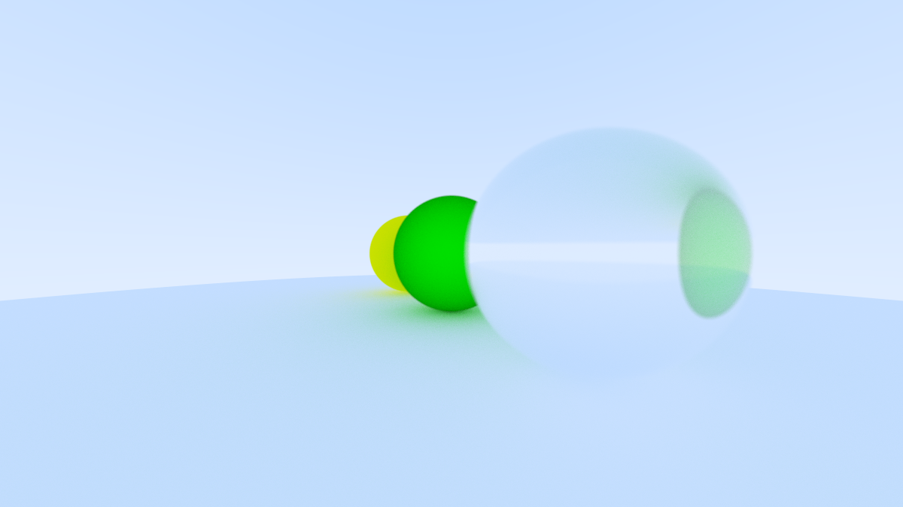

# Ray tracer

CPU-based Mini ray tracer written in C++ with multiple material types, anti-aliasing, depth of field and customizable camera parameters and multithreading support.


## Building
### Requirements
- C++ Compiler
- CMake 3.10+

### Build Instructions

Clone the repository:
```
git clone https://github.com/ihsanfz/raytracer.git
cd raytracer/src
```

Build the project:
```
cmake -S . -B build
cmake --build build
cd build
```

Run the renderer:
```
./raytracer
```
and wait for the `image.ppm` file to finish rendering.

## Screenshots




## References
https://raytracing.github.io/books/RayTracingInOneWeekend.html
